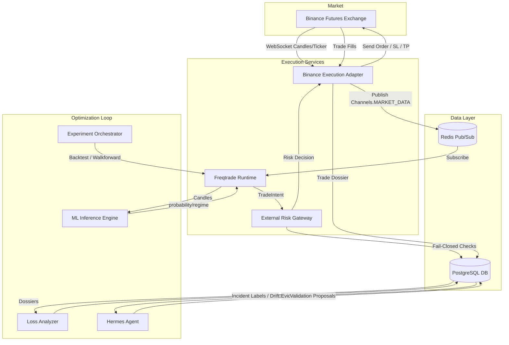

# System Architecture — Hermes Adaptive Futures Trading Platform

This document describes the technical architecture and autonomous optimization loop of the platform.

## Core Modules

### 1. Binance Execution Adapter (`services/binance-adapter`)
The single entry point interfacing with Binance USDT-M Futures. Handles CCXT/REST calls, signed HTTP requests (HMAC-SHA256), and private WebSocket user streams (ORDER_TRADE_UPDATE, ACCOUNT_UPDATE). Publishes normalized objects to the Redis Message Bus.

### 2. External Risk Gateway (`services/risk-gateway`)
A strict **fail-closed** gateway. Validates entry intents before they reach the execution adapter. Checks:
- Kill switch levels (Yellow, Orange, Red, Black).
- Daily drawdown limit percentage.
- Leverage limit.
- Market data freshness and consistency.
- Required Stop-Loss & Take-Profit targets.

### 3. Freqtrade Runtime (`services/freqtrade-runtime`)
Executes the trading strategy in a sandboxed, immutable environment. Generates trade intents and requests permission from the Risk Gateway via API.

### 4. ML Inference Engine (`services/model-inference`)
Calculates pure-numpy technical indicators (EMA, RSI, ATR, BB, ADX) and predicts bullish probability alongside current market regime classification. Supports scikit-learn models and rule-based fallbacks.

### 5. Loss Analyzer (`services/loss-analyzer`)
Periodically analyzes closed trades to classify losses (regime mismatch, tight SL noise, execution slippage, technical failures) and detect drift in market return distributions.

### 6. Hermes Agent (`services/hermes-agent`)
Aggregates read-only trading dossiers. Applies deterministic pattern detection rules to formulate experiment proposals (e.g., tweaking stop-loss ATR multipliers or adjusting regime filter thresholds). It has **no permission** to alter production parameters directly.

### 7. Experiment Orchestrator (`services/experiment-orchestrator`)
Manages candidate strategy deployment through testing phases: backtest, walk-forward validation, stress testing, and shadow modes. Promotes candidates to live canary only after manual Owner confirmation.
